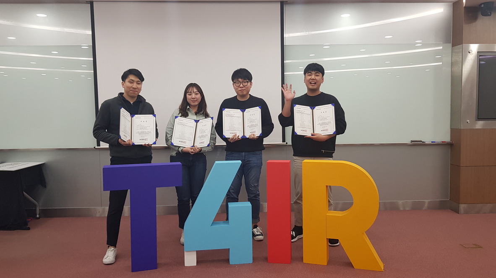
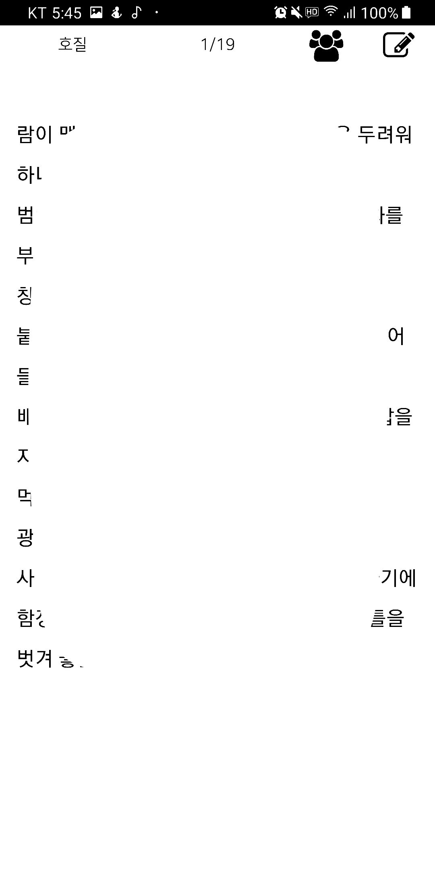
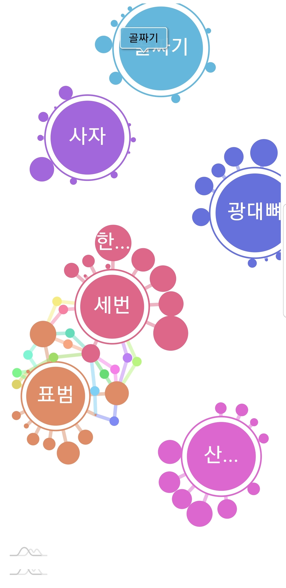
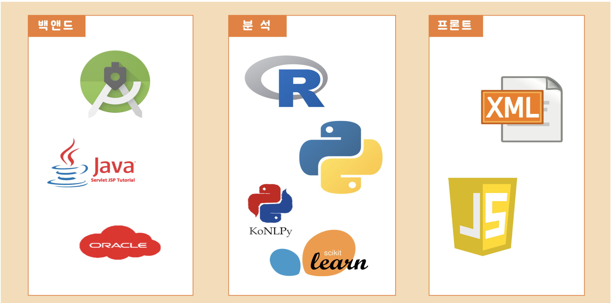
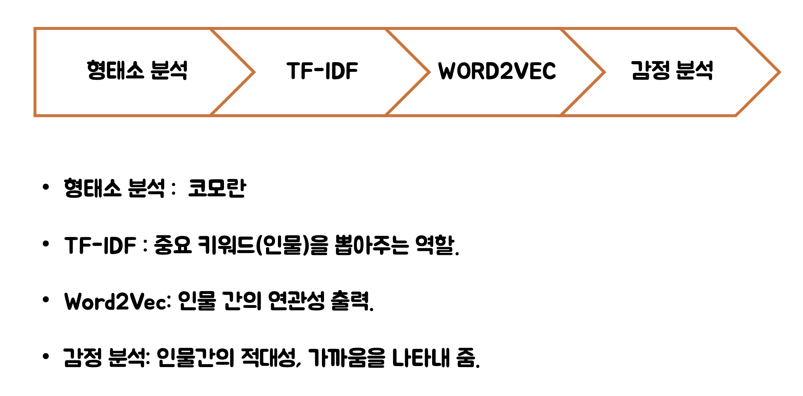

# GGo G Book(꼬지북)

## 1. 프로젝트명

- 꼬지북(Ggo g book) - 책꽂이 + E-Book의 합성어

  

## 2. 프로젝트 소개

- 인물 관계도를 자동 생성 해주고 한 눈에 볼 수 있게 해주는 E-BOOK 어플리케이션




## 3. 어플리케이션 사용 예제







## 4. 개발 환경




## 5. 프로젝트 흐름

- 안드로이드 스튜디오 프론트엔드
- 페이지 기능
- 데이터 전처리
- 인물관계도 조정을 위한 데이터 분석

## 6. 데이터 분석 과정



## 7. 라이센스 및 작성자 정보

```
Copyright ⓒ 2019, 멀티캠퍼스 오픈API를 활용한 빅데이터 전처리, 시각화과정 B반 꼬부기
```

